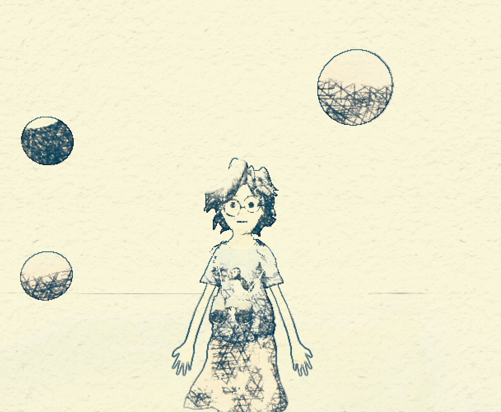

# NPR Rendering Engine
For my Senior Capstone project, I created a Non-Photorealistic Rendering Engine in Maya. It is based loosely on the publication [MNPR: A Framework for Real-Time Expressive Non-Photorealistic Rendering of 3D Computer Graphics.](https://artineering.io/publications/MNPR/)

This project is a plugin for Maya 2019, implemented in Maya C++ API. The bulk of the tool is an override of Maya’s native viewport rendering framework, called an MRenderOverride. For my engine, I combine Maya’s native scene rendering pipeline (its standard vertex and fragment shaders, which allow for features like dynamic lighting, shadows, and material effects) with an extensive post-processing pipeline that contained several art-directable effects for non photorealistic rendering.

Each post-process effect is implemented in a GPU shader. These are written in the OGSFX file format, a wrapper format in Maya which allows the user to combine a pipeline of GLSL vertex and fragment shaders into one file. Since these rendering calculations are done on the GPU, users can edit and review their stylizations in real time.

# Watercolor Rendering

The first NPR effect that I reproduce is expressive watercolor shading. The defining feature of this tool is enabling users to paint specific aspects of stylization (edge darkening, color bleeding, paint dryness, and turbulence) directly onto the model, using Maya’s native paint vertex colors tool. This creates a “control image” that is passed as a frame buffer throughout the rest of the pipeline. The RGBA channels in this image are then sampled as parameters for the four different effects.

In addition to the post process shaders, which apply global control, users can specify materials in Maya that implement part of the watercolor pipeline. These are done through the glslShader plugin in Maya, which allows users to create new materials based on custom OGSFX files.

The final image (left) and the control image (right).

# Tonal Art Map Hatching

The crosshatching algorithm is based loosely on the paper [Real-Time Hatching,](http://hhoppe.com/proj/hatching/) which utilizes Tonal Art Maps (TAMS). TAMS are textures that represent the basic strokes of an artist. Depending on the scene’s lighting, various TAMs are layered on top of one another to simulate the layering of hatching strokes. Darker spots have more TAM layers, and lighter spots have fewer. My implementation differs from the original in that it takes place in image, rather than object, space. A user-specified TAM texture is passed into a shader, and drawn multiple times in cells of a grid that spans the image. Within each cell, the texture is rotated and offset, based on user parameters, which helps to create more organic looking images and reduce cell artifacts. Based on the luminance at each image fragment, the TAM is layered between zero and six times for the lightest and darkest spots, respectively. The number of layers is based on luminance thresholds, similar to those used in posterization effects. A smooth step function is used to lightly interpolate TAM alpha between thresholds, to prevent undesirable hard transitions in luminance.

Edge detection is done through a Sobel filter. The user can specify whether to use the scene’s depth map or color map in the filter. The resultant outline image is then passed to a dilation filter, which is used to either thicken or reduce line weight based on user parameters.

# Experimental Results
Below are some artistic experiments made with the tool:

# Resources
- [MNPR](https://artineering.io/software/MNPRX/)
- [Art-directed watercolor stylization of 3D animations in real-time](https://artineering.io/publications/Art-Directed-Watercolor-Stylization-of-3D-Animations-in-Real-Time/)
- [Edge- and substrate-based effects for watercolor stylization](https://artineering.io/publications/Edge-and-Substrate-Based-Effects-for-Watercolor-Stylization/)
- [Real Time Hatching](http://hhoppe.com/proj/hatching/)
- [Man Wearing Wreath Model by Geoffrey Marchal (Licensed under Creative Commons)](https://sketchfab.com/3d-models/man-wearing-a-wreath-1cebca66989a48b091b027e24c561f4c)
- [Maya API Reference](https://help.autodesk.com/view/MAYAUL/2017/ENU/?guid=__cpp_ref_index_html)
